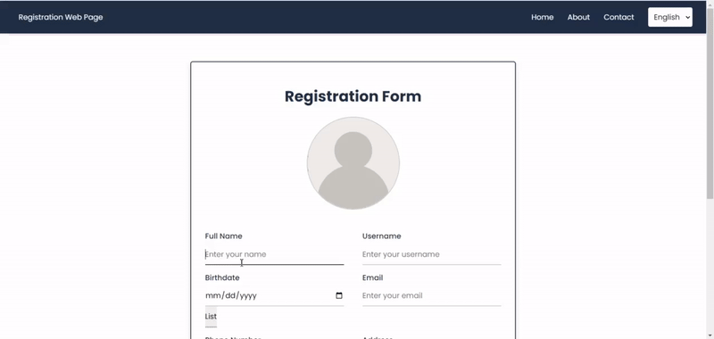

# Laravel Registration Webpage




## Overview

The Laravel Registration Webpage project is a comprehensive application designed to manage user registrations effectively. It incorporates key features to enhance user experience and ensure data integrity.

## Features
1. **User Registration Form**: 
Collects personal details including full name, username, birthdate, phone number, address, password, confirm password, user image, and email.

2. **Client-Side Validations**: 
Ensures all fields are mandatory and validates email, birthdate, full name, password, and confirm password using JavaScript.

3. **Server-Side Validations**: 
Checks for duplicate usernames in the database and handles image upload and validation.


4. **User Image Upload**:
Allows users to upload and store their profile images on the server, with image names stored in the database.
Actor Information API Integration: Utilizes the MDBI API to fetch and display actors born on the same date as the user’s birthdate.

5. **Dynamic Header and Footer**:
Includes reusable header and footer components for a consistent look and feel across the site.
6. **Automatic Email Notification**:
   - An email is automatically sent upon a new user registration with the subject "New registered user" and the content "A new user `<username>` is registered to the system".

7. **Automated Testing**:
   - Five automated test functions are included using Laravel's testing framework, with at least one feature test ensuring that new student data is inserted and displayed correctly.

8. **Multi-Language Support**:
   - Supports English and an additional language (recommended: Arabic), allowing users to switch between languages.

9. **Client-Side and Server-Side Validations**:
   - Validations are implemented to ensure data integrity and proper user input validation.

10. **Laravel Master Layout**:
   - Uses Laravel's master layout feature to include a consistent header and footer across all pages.

11. **AJAX Support**:
   - Implements AJAX and integrates a born-in-the-same-day API for dynamic content updates.

12. **Password Encryption**:
   - Utilizes Laravel's built-in encryption methods to secure user passwords.

## Installation

1. **Clone the Repository**:
   ```bash
   git clone https://github.com/your-username/laravel-registration-webpage.git
   ```

2. **Navigate to the Project Directory**:
   ```bash
   cd laravel-registration-webpage
   ```

3. **Install Dependencies**:
   ```bash
   composer install
   ```

4. **Set Up Environment**:
   - Copy the `.env.example` file to `.env` and configure your database and mail settings.

5. **Generate Application Key**:
   ```bash
   php artisan key:generate
   ```

6. **Run Migrations**:
   ```bash
   php artisan migrate
   ```

7. **Start the Laravel Development Server**:
   ```bash
   php artisan serve
   ```

## Usage

- Access the registration form at `http://localhost:8000/register`.
- Upon successful registration, an automatic email notification will be sent.
- Use Laravel's testing commands to run automated tests:
  ```bash
  php artisan test
  ```

## Multi-Language Support

- Switch between English and the additional language (e.g., Arabic) using the language selector available on the webpage.

